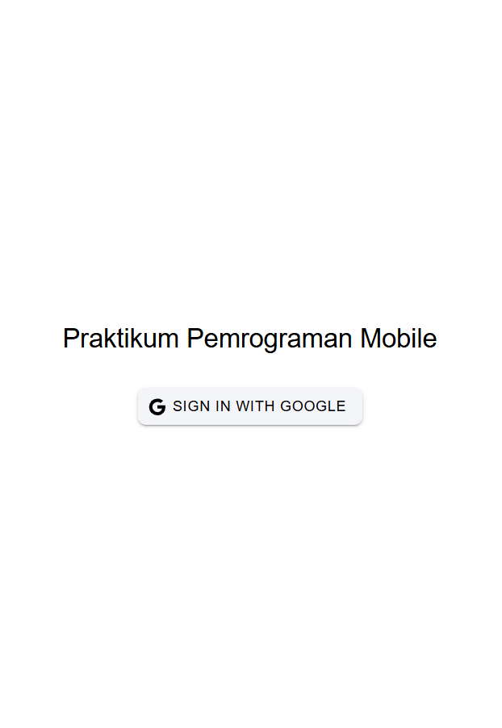
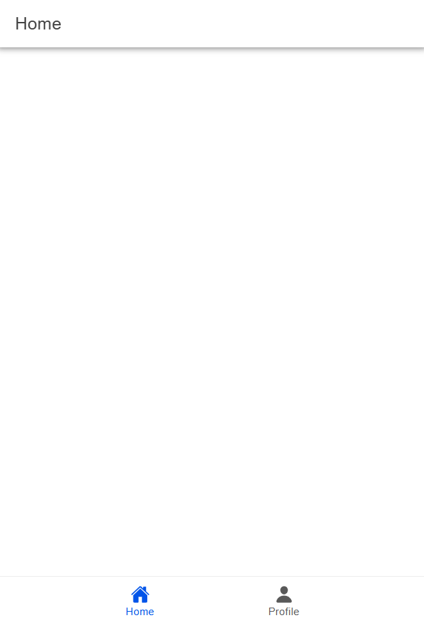
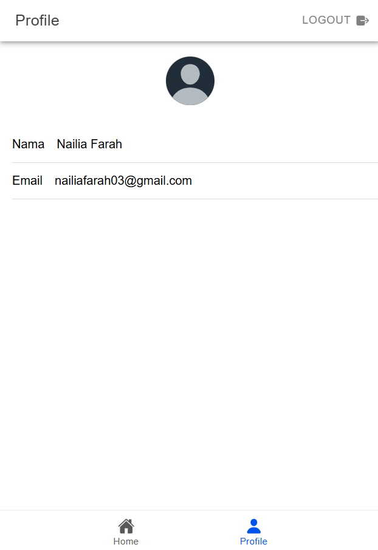

Penjelasan Alur Kerja Aplikasi Ionic dengan Firebase Authentication menggunakan Google Login

1. Inisialisasi Firebase
   File `src/utils/firebase.ts` digunakan untuk menginisialisasi Firebase dengan konfigurasi proyek yang meliputi `apiKey`, `authDomain`, dan lainnya. Firebase diatur untuk menyediakan layanan autentikasi dan Google sebagai penyedia login:
   ```typescript
   const firebase = initializeApp(firebaseConfig);
   const auth = getAuth(firebase);
   const googleProvider = new GoogleAuthProvider();
   ```

2. State Management Menggunakan Pinia
   Store `auth` dibuat di `src/stores/auth.ts` menggunakan Pinia untuk menyimpan dan mengelola data user. Store ini memiliki:
   - Variabel `user` untuk menyimpan informasi user yang sedang login.
   - Fungsi `loginWithGoogle` untuk proses autentikasi login Google.
   - Fungsi `logout` untuk keluar dari akun.

3. Proses Login dengan Google
   - Fungsi `loginWithGoogle` menggunakan plugin Capacitor `@codetrix-studio/capacitor-google-auth` untuk mendapatkan token Google.
   - Setelah token berhasil diambil, token ini dikonversi menjadi kredensial Firebase menggunakan:
     ```typescript
     const credential = GoogleAuthProvider.credential(idToken);
     const result = await signInWithCredential(auth, credential);
     ```
   - Informasi pengguna seperti nama dan email diakses dari `result.user`.

4. Pengecekan State Login
   - Firebase menggunakan `onAuthStateChanged` untuk mendeteksi perubahan status autentikasi pengguna. Jika pengguna login atau logout, state `user` diperbarui secara otomatis:
     ```typescript
     onAuthStateChanged(auth, (currentUser) => {
         user.value = currentUser;
     });
     ```

5. Routing dan Middleware Autentikasi
   - Aplikasi menggunakan meta property di route untuk membedakan halaman yang membutuhkan autentikasi (`isAuth: true`) atau tidak (`isAuth: false`).
   - Sebelum setiap transisi halaman, middleware memeriksa apakah pengguna sudah login atau belum. Jika belum login, pengguna diarahkan ke halaman `/login`.

6. Komponen Login Page
   - Tombol login pada `loginpage.vue` memanggil fungsi `loginWithGoogle` dari store:
     ```html
     <ion-button @click="login" color="light">
         <ion-icon slot="start" :icon="logoGoogle"></ion-icon>
         <ion-label>Sign In with Google</ion-label>
     </ion-button>
     ```
   - Setelah login sukses, pengguna diarahkan ke halaman `/home`.

7. Komponen Profile Page
   - Halaman profil di `profilpage.vue` menampilkan data pengguna yang telah login seperti nama (`user?.displayName`) dan email (`user?.email`):
     ```html
     <ion-input label="Nama" :value="user?.displayName" :readonly="true"></ion-input>
     <ion-input label="Email" :value="user?.email" :readonly="true"></ion-input>
     ```
   - Gambar profil diambil dari `user.photoURL` dan ditampilkan dalam elemen avatar.

8. Logout  
   - Tombol logout memanggil fungsi `logout` untuk keluar dari akun Firebase dan Google. Setelah itu, pengguna diarahkan kembali ke halaman `/login`.

Alur :
1. Pengguna membuka aplikasi dan diarahkan ke halaman login.
2. Di halaman login, pengguna menekan tombol **Sign In with Google**.
3. Aplikasi menggunakan Capacitor untuk login ke Google, mengambil token, dan mengautentikasi pengguna dengan Firebase.
4. Setelah login berhasil, informasi pengguna seperti nama dan email disimpan dalam `authStore` dan ditampilkan di halaman profil.
5. Pengguna dapat logout untuk keluar dari aplikasi, menghapus state user, dan diarahkan ke halaman login.

Sistem ini memastikan keamanan dengan menggunakan Firebase Authentication dan memberikan pengalaman login yang mudah melalui Google.

